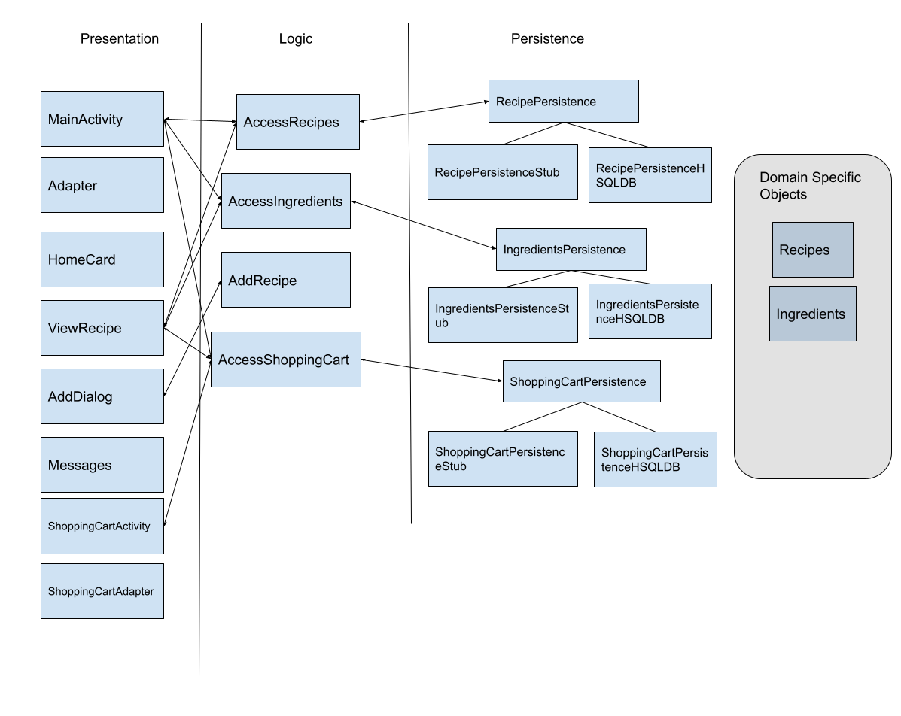

# Architecture Overview
---

We will be using a 3-tier architecture consisting of the presentation, data(persistence), and logic layers. With this architecture, our project is broken up into 5 java packages of `application`, `logic`, `objects`, `persistence`, and `presentation`.
 
## Presentation Layer
---
In its current iteration, the presentation layer contains 4 classes of HomeCard, viewRecipe, Adapter, and MainActivity.
- `mainActivity` acts as the homepage for our app. Within this home screen, it will contain the popular dish "cards" that provides the user quicker access to these recipes. Recipes that can't be accessed this way are accessible via the search bar.
- `HomeCard` is used as a helper class in displaying the popular recipe cards on the homepage.
- `ViewRecipe` will be used to show the recipes the user is looking at. Within this will be pictures, directions, ingredients, and a rating system.
- `Adapter` is used as a helper class in displaying the popular recipe cards on the homepage.

## Persistence Layer
---
- `DBInterface` is used as an interface that the logic layer will access.
- `DataBaseAccess` is used to modify and alter the database.

## Logic Layer
---
- `ShowRecipe` handles all the logic and information about the recipe that the user is trying to look at.
- `AccessRecipes` will contain functionality for accessing some data from the data layer.

## Domain Specific Objects
---
- `Ingredient` will be used to contain information about the ingredients in any given dish.
- `Recipe` contains most of the information surrounding the actual preparation of the dish.

## Diagram
---

